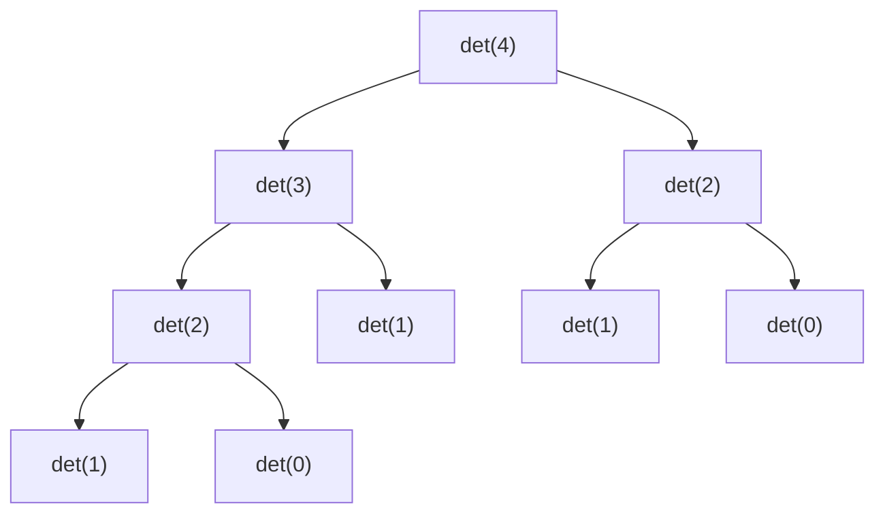

# Recursion Tree for `climbStairs(n)` (n = 4)

## Recurrence Relation

To analyze or trace the recursion, we first establish the recurrence relation for the problem:

\[
f(n) = f(n-1) + f(n-2)
\]

**Explanation:**
- To reach the \( n \)-th step, you can come from either:
  - the \((n-1)\)-th step (by taking 1 step), or
  - the \((n-2)\)-th step (by taking 2 steps).
- So, the total number of ways to reach the \( n \)-th step is the sum of the ways to reach the previous two steps.

**Base cases:**
- \( f(1) = 1 \) (only one way to climb one step)
- \( f(2) = 2 \) (either two single steps or one double step)

This recurrence relation forms the basis for the recursive code and the recursion tree below.

---

## Recursion Tree for `climbStairs(4)`

```
climbStairs(4)
│
├── det(3)
│   ├── det(2)
│   └── det(1)
└── det(2)
```

### Expanded Recursion Tree (showing all calls):

```
det(4)
├── det(3)
│   ├── det(2)
│   │   ├── det(1)
│   │   └── det(0)
│   └── det(1)
└── det(2)
    ├── det(1)
    └── det(0)
```

### Step-by-step Expansion:
- `det(4)` calls `det(3)` and `det(2)`
- `det(3)` calls `det(2)` and `det(1)`
- `det(2)` calls `det(1)` and `det(0)`
- Base cases: `det(1)` and `det(0)`

### Visual Representation



---

## Notes
- The recursion tree grows exponentially with n.
- Memoization (as in your code) prevents repeated computation, but the tree above shows the structure without memoization.
- Each node splits into two until the base case (`n <= 2`). 